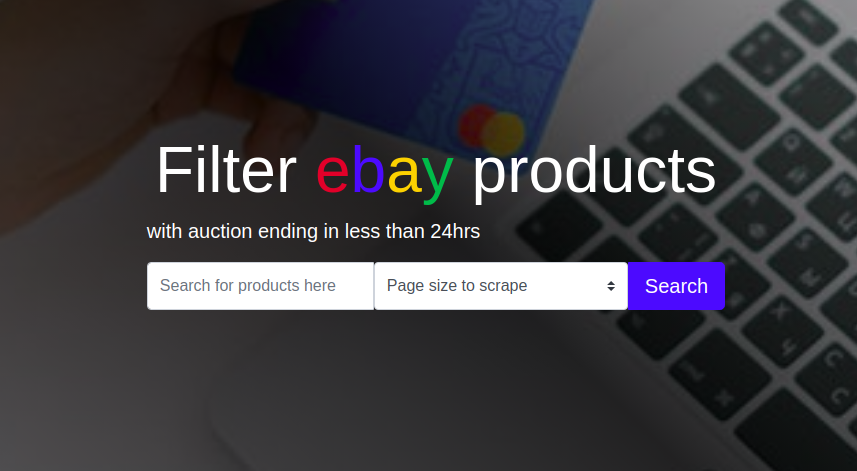
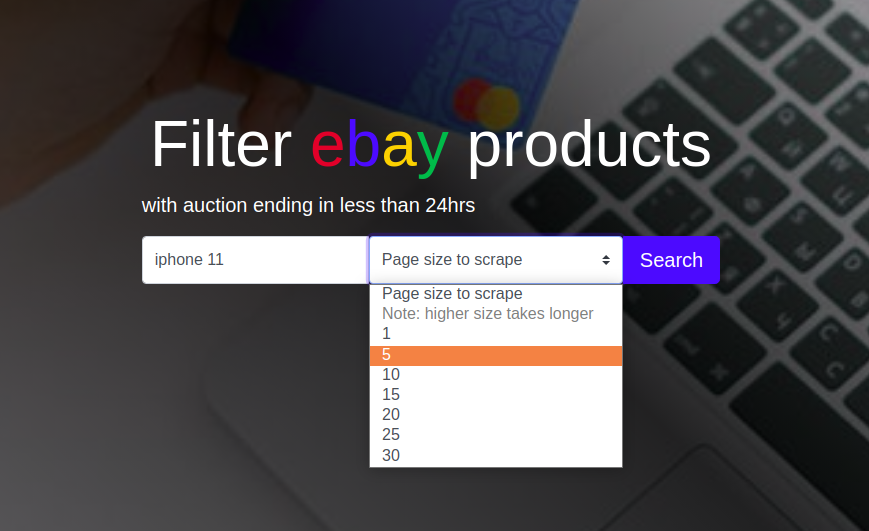
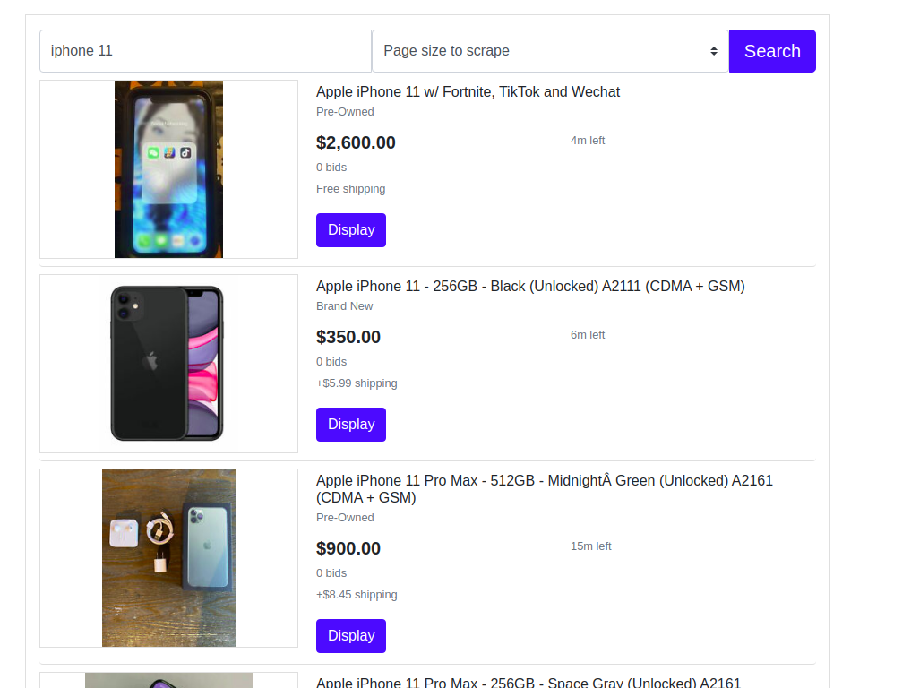

# Best ebay deals

> This project is a scraper for products on [ebay](https://ebay.com), with auction ending in less than 24hrs


The project uses open-uri to open http request to a customized ebay web address and creats a Nokogiri object based on the HTML parsed from the address.
- also fetches more HTML by updating the page number query string.
- once done with fetching, serves a search result page with ebay products filtered to have auction ending in less than 24hrs.

## Built With

- Ruby
- Sinatra
- HTML5
- Sass
- bootstrap

## Live Demo

[Live Demo Link](https://bayhunt.herokuapp.com/)

## How to use thie repo?

## option 1 (using the live site)

- step:1 go to the link below
```
https://bayhunt.herokuapp.com/
```
- step:2 you will be presented with a page that looks like this



- step:3 type the product you want to search in the input field, select an optional page size for scraping and click on the search button



- step:4 your result will be presented as shown below



## option 2 (run on local machine)

To get a local copy up and running follow these simple example steps.

### Prerequisites

- ruby
- nokogiri
- sinatra

### Install
```
gem install ruby 
```
```
gem install nokogiri
```
```
gem install sinatra
```

### Setup

- clone the repository, and open the repo in terminal
- run bundler to get all the necessary gems
```
bundle install
```
- start the webserver using rackup
```
rackup -p 4567
```

### Usage

- open a browser, and navigate to
```
http://localhost:4568/
```
- follow the steps in option 1 starting from step 2

## Tests
- on the root path of the repo, run the following command
```
rspec
```

## Authors

👤 **Binyam Hailemeskel**

- GitHub: [@bini-i](https://github.com/bini-i)
- Twitter: [@binyamshewa](https://twitter.com/binyamshewa)
- LinkedIn: [binyam hailemeskel](https://www.linkedin.com/in/bini-i/)

## 🤝 Contributing

Contributions, issues, and feature requests are welcome!

## Show your support

Give a ⭐️ if you like this project!

## Acknowledgments

- ebay
- Nokogiri

## 📝 License

This project is [MIT](./LICENSE) licensed.
